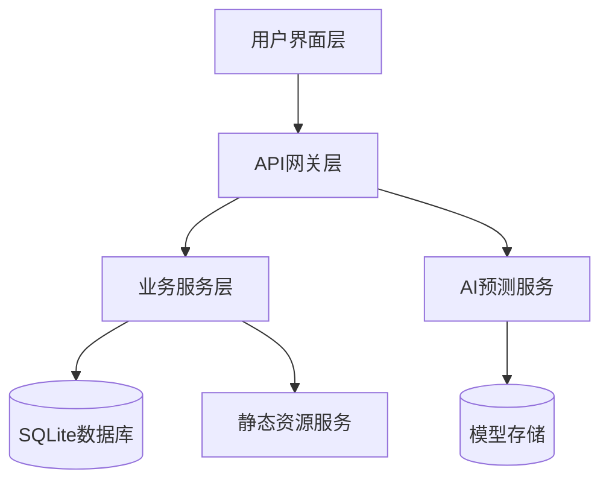
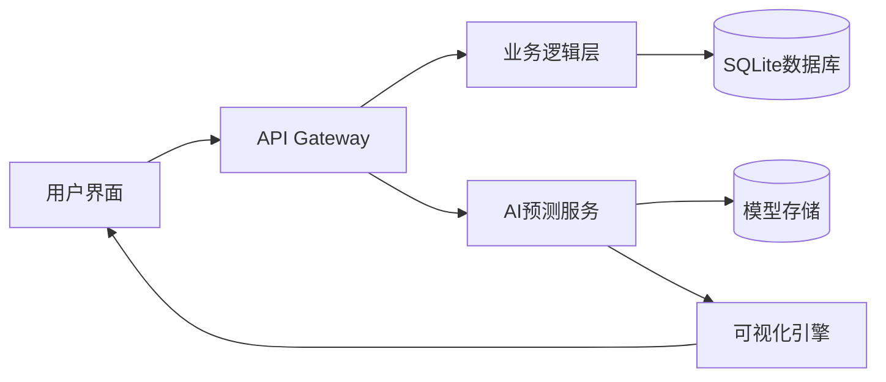

# 🔌 PowerEdu-AI 电力知识库与AI预测平台

> **PowerEdu-AI** - 集成电力知识库在线学习与AI负荷预测功能的企业级智能平台

[](https://python.org)
[](https://djangoproject.com)
[](https://reactjs.org)
[](https://vitejs.dev)
[](./LICENSE)
[]()
[]()

## 📋 项目概述

PowerEdu-AI是一个面向电力行业的综合性智能教育平台，集成了知识库管理、在线学习和AI负荷预测等核心功能。本平台采用现代化的微服务架构，为电力从业人员提供专业的学习资源和智能预测工具。

### 🏗️ 系统架构



### 🎯 核心功能模块

| 模块 | 功能描述 | 技术特性 |
|------|----------|----------|
| **📚 教育平台** | 用户管理、课程系统、互动学习 | Django + REST API |
| **🤖 AI预测引擎** | 多模型负荷预测、实时分析 | scikit-learn + XGBoost |
| **📊 数据可视化** | 交互式图表、性能监控 | Plotly.js + Recharts |
| **🎨 用户界面** | 响应式设计、现代化交互 | React 18 + Antd 5.x |

## 🚀 快速部署

### 💻 系统要求

| 组件 | 最低要求 | 推荐配置 | 备注 |
|------|----------|----------|------|
| **操作系统** | Windows 10 / macOS 10.15 / Ubuntu 18.04 | Windows 11 / macOS 12+ / Ubuntu 20.04+ | 支持64位架构 |
| **Python** | 3.8+ | 3.9+ (已测试至3.13) | 建议使用虚拟环境 |
| **Node.js** | 18.15+ | 18.18+ LTS | 包含npm包管理器 |
| **RAM** | 4GB | 8GB+ | AI训练需要更多内存 |
| **存储** | 2GB | 5GB+ SSD | 包含依赖和模型文件 |
| **浏览器** | Chrome 90+ / Firefox 88+ / Safari 14+ | 最新稳定版 | 支持ES2020+ |

### ⚡ 一键启动（推荐）

```bash
# Windows 用户
.\start.ps1

# Linux/macOS 用户
chmod +x start.sh && ./start.sh
```

### � 手动部署

<details>
<summary>📖 点击查看详细部署步骤</summary>

#### 1️⃣ 项目初始化

```bash
# 克隆项目仓库
git clone https://github.com/cfn0324/PowerEdu-AI.git
cd PowerEdu-AI

# 创建Python虚拟环境（推荐）
python -m venv venv
source venv/bin/activate  # Linux/macOS
# 或者 venv\Scripts\activate  # Windows

# 安装Python依赖
pip install -r requirements.txt
```

#### 2️⃣ 后端服务启动

```bash
cd backend

# 数据库迁移
python manage.py migrate

# 创建超级用户（可选）
python manage.py createsuperuser

# 启动开发服务器
python manage.py runserver 8000
```

#### 3️⃣ 前端应用启动

```bash
cd frontend

# 安装Node.js依赖
npm install

# 启动开发服务器
npm run dev
```

#### 4️⃣ AI系统初始化

访问 `http://localhost:5173/prediction` 并点击"初始化AI系统"按钮完成机器学习模型的训练和配置。

</details>

## 🤖 AI预测系统

### 🎯 预测功能矩阵

| 功能类型 | 描述 | 应用场景 | 技术实现 |
|---------|------|----------|----------|
| **单点预测** | 实时预测特定时间点负荷 | 实时调度、应急响应 | 在线推理 |
| **批量预测** | 批处理多时间点预测 | 运行分析、历史回顾 | 批处理引擎 |
| **日前预测** | 96点15分钟间隔预测 | 发电计划、市场交易 | 时序建模 |
| **不确定性分析** | 预测置信区间量化 | 风险评估、决策支持 | 概率建模 |

### 🧠 机器学习算法栈

#### 📊 传统机器学习
- **线性回归** (Linear Regression) - 基线模型，快速训练
- **随机森林** (Random Forest) - 集成学习，特征重要性分析
- **梯度提升** (Gradient Boosting) - 高精度预测
- **XGBoost** - 工业级梯度提升，支持GPU加速
- **支持向量回归** (SVR) - 非线性映射，鲁棒性强

#### 🔗 深度学习（可选）
- **LSTM** - 长短期记忆网络，处理长序列依赖
- **GRU** - 门控循环单元，训练效率更高
- **Transformer** - 注意力机制，捕获复杂模式

### 📊 数据处理管道

```python
# 数据处理流程示例
数据源 → 特征提取 → 数据清洗 → 特征工程 → 模型训练 → 预测推理
```

#### 🔄 特征工程
- **时间特征**：小时、日、周、月、季节、节假日标识
- **气象特征**：温度、湿度、风速、降雨量、气压
- **历史特征**：滞后项、滑动窗口统计、趋势特征
- **周期特征**：日周期、周周期、年周期分解

#### �️ 数据预处理
- **异常检测**：基于统计方法和机器学习的异常识别
- **缺失值处理**：插值、前向填充、基于模型的填补
- **数据归一化**：Z-score标准化、Min-Max缩放
- **特征选择**：相关性分析、重要性排序、递归特征消除

### � 模型评估与监控

#### 🎯 评估指标
| 指标 | 公式 | 含义 | 应用场景 |
|------|------|------|----------|
| **MAE** | $\frac{1}{n}\sum\|y_i - \hat{y_i}\|$ | 平均绝对误差 | 通用评估 |
| **RMSE** | $\sqrt{\frac{1}{n}\sum(y_i - \hat{y_i})^2}$ | 均方根误差 | 惩罚大误差 |
| **MAPE** | $\frac{100}{n}\sum\frac{\|y_i - \hat{y_i}\|}{\|y_i\|}$ | 平均绝对百分比误差 | 相对性能 |
| **R²** | $1 - \frac{SS_{res}}{SS_{tot}}$ | 决定系数 | 解释能力 |

#### 📊 可视化分析
- **预测vs实际**：散点图、时序图、残差分析
- **模型性能**：ROC曲线、学习曲线、验证曲线
- **特征重要性**：柱状图、热力图、SHAP值分析
- **误差分布**：直方图、QQ图、误差热力图

### 预测因素分析
- **低精度预测原因分析**：自动识别预测误差较大的原因
- **影响因子权重分析**：分析不同因素对负荷的影响程度
- **异常点检测**：识别异常负荷模式和潜在原因
- **相关性分析**：气象因素与负荷变化的关联分析

## 🏗️ 系统架构

### 📁 项目结构

```
PowerEdu-AI/
├── 📁 backend/                  # Django后端服务
│   ├── � manage.py            # 项目管理脚本
│   ├── ⚙️ edu/                 # 核心配置模块
│   │   ├── settings.py         # 应用配置
│   │   ├── urls.py            # 路由配置  
│   │   └── wsgi.py            # WSGI入口
│   ├── � apps/                # 业务应用模块
│   │   ├── � user/           # 用户管理
│   │   ├── � course/         # 课程管理
│   │   └── 🤖 prediction/     # AI预测服务
│   ├── 🧠 ai_prediction/       # AI引擎核心
│   │   ├── data_generator.py  # 数据生成器
│   │   ├── data_preprocessor.py # 数据预处理
│   │   ├── model_manager.py   # 模型管理器
│   │   ├── predictor.py       # 预测引擎
│   │   └── visualizer.py      # 可视化模块
│   └── 🎨 static/             # 静态资源
├── 📁 frontend/                # React前端应用
│   ├── 📦 package.json        # 依赖配置
│   ├── ⚙️ vite.config.js      # 构建配置
│   └── 📁 src/               # 源代码目录
│       ├── 🧩 components/    # 通用组件
│       ├── 📄 pages/        # 页面组件
│       │   ├── 🏠 home/     # 首页
│       │   ├── 📚 courses/  # 课程管理
│       │   ├── � profile/  # 用户中心
│       │   └── 🤖 prediction/ # AI预测界面
│       ├── 🛣️ router/       # 路由管理
│       ├── � service/      # API服务
│       └── 📊 stores/       # 状态管理
├── 📄 README.md             # 项目文档
├── 📄 requirements.txt      # Python依赖
├── 📄 LICENSE               # 开源协议
└── 🚀 start.ps1 / start.sh  # 启动脚本
```

### 🔄 数据流架构


│   │   │   ├── views.py       # 用户API视图
│   │   │   └── schemas.py     # 数据验证模式
│   │   ├── 📚 course/         # 课程管理系统
│   │   │   ├── models.py      # 课程数据模型
│   │   │   ├── views.py       # 课程API视图
│   │   │   └── admin.py       # 管理后台配置
│   │   └── 🤖 prediction/     # AI预测系统
│   │       ├── models.py      # 预测数据模型
│   │       ├── views.py       # 预测API视图
│   │       └── admin.py       # 预测管理后台
│   ├── 🧠 ai_prediction/       # AI预测核心引擎
│   │   ├── data_generator.py  # 智能数据生成器
│   │   ├── data_preprocessor.py # 数据预处理引擎
│   │   ├── model_manager.py   # 机器学习模型管理
│   │   ├── predictor.py       # 电力负荷预测器
│   │   └── visualizer.py      # 数据可视化工具
│   └── 🎨 static/             # 静态资源文件
└── 🗂️ frontend/               # React前端应用
    ├── 📄 package.json        # 前端依赖配置
    ├── ⚙️ vite.config.js      # Vite构建配置
    ├── 📄 index.html          # 应用入口页面
    └── 📁 src/               # 前端源代码
        ├── 🎬 main.jsx       # React应用入口
        ├── 🎨 index.css      # 全局样式
        ├── 🧩 components/    # 可复用组件库
        ├── 📄 pages/        # 页面组件集合
        │   ├── 🏠 home/     # 首页组件
        │   ├── 📚 courses/  # 课程页面
        │   ├── 📖 detail/   # 课程详情页
        │   ├── 👤 profile/  # 用户个人中心
        │   └── 🤖 prediction/ # AI预测功能页面
        │       ├── index.jsx           # 主预测界面
        │       ├── PredictionDashboard.jsx # 预测仪表板
        │       ├── SinglePrediction.jsx    # 单点预测
        │       ├── BatchPrediction.jsx     # 批量预测
        │       ├── DayAheadPrediction.jsx  # 日前预测
        │       ├── ModelComparison.jsx     # 模型性能对比
        │       └── PredictionHistory.jsx   # 预测历史记录
        ├── 🛣️ router/       # 路由配置
        ├── 🔧 service/      # API服务层
        └── 📊 stores/       # 状态管理
```
    ├── 原型设计/
    ├── 系统设计/
    ├── 系统测试/
    └── 项目答辩/
```

## 🚀 快速开始

### 环境要求
- **Python**: 3.8+ (推荐3.9+)
- **Node.js**: 18.15+ (推荐18.18+)
- **包管理器**: pip, npm
- **内存**: 最少4GB，推荐8GB+
- **存储**: 至少2GB可用空间

### 🎯 一键启动（推荐）

**Windows系统**:
```powershell
.\start.ps1
```

**Linux/Mac系统**:
```bash
chmod +x start.sh
./start.sh
```

### 📝 手动启动

#### 1. 克隆项目并安装Python依赖
```bash
git clone <repository-url>
cd PowerEdu-AI

# 安装Python依赖
pip install -r requirements.txt
```

**⚠️ Python 3.13兼容性说明**：
如果您使用Python 3.13遇到依赖安装问题，可以尝试以下解决方案。

**快速解决Pillow问题**：
```bash
# 如果Pillow安装失败，尝试：
pip install --upgrade pip
pip install Pillow --upgrade
# 或使用预编译版本：
pip install --only-binary=all Pillow
```

#### 2. 初始化并启动Django后端
```bash
cd backend
python manage.py migrate          # 初始化数据库
python manage.py createsuperuser  # 创建管理员账户（可选）
python manage.py runserver        # 启动后端服务 (http://localhost:8000)
```

#### 3. 安装并启动React前端
```bash
cd frontend
npm install                       # 安装前端依赖
npm run dev                       # 启动前端服务 (http://localhost:5173)
```

## 🌐 服务端点

启动成功后，您可以通过以下地址访问系统：

| 服务 | 地址 | 描述 | 状态监控 |
|------|------|------|----------|
| **前端主界面** | http://localhost:5173 | React SPA应用 | []() |
| **AI预测模块** | http://localhost:5173/prediction | 智能预测功能 | []() |
| **后端API** | http://localhost:8000/api | RESTful API服务 | []() |
| **管理后台** | http://localhost:8000/admin | Django Admin | []() |
| **API文档** | http://localhost:8000/api/docs | Swagger文档 | []() |

### 🔐 默认凭证

| 类型 | 用户名 | 密码 | 权限级别 |
|------|--------|------|----------|
| **系统管理员** | admin | admin123 | 超级用户 |
| **演示用户** | demo | demo123 | 普通用户 |

> 💡 **安全提示**: 生产环境部署时请务必修改默认密码！

## 🎯 核心功能特性

### � 教育平台能力
- **👤 用户管理**: 注册登录、权限控制、个人中心
- **📖 课程系统**: 课程发布、章节管理、视频播放
- **� 互动学习**: 评论讨论、学习进度、收藏功能
- **📊 数据统计**: 学习分析、成绩跟踪、活动监控

### 🤖 AI预测引擎
- **⚡ 实时预测**: 单点/批量负荷预测，毫秒级响应
- **📅 日前预测**: 96点15分钟间隔完整日负荷曲线
- **🔬 模型管理**: 多算法自动训练、性能评估、模型选择
- **📊 智能分析**: 可视化展示、误差分析、影响因子识别
- **📜 历史追溯**: 预测记录管理、结果对比、趋势分析

### 🛡️ 系统管理
- **🔄 自动化运维**: 一键初始化、智能监控、异常告警
- **💾 数据管理**: 合成数据生成、数据清洗、特征工程
- **🔧 模型运维**: 自动保存加载、版本管理、性能监控
- **🌐 API服务**: RESTful接口、文档自动生成、接口测试

## 🔧 技术架构栈

### 🖥️ 后端技术栈

| 技术组件 | 版本 | 用途 | 特性 |
|---------|------|------|------|
| **Django** | 4.2.7 | Web框架 | ORM, 管理后台, 中间件 |
| **Django Ninja** | 1.0.1 | API框架 | 类型提示, 自动文档, 性能优化 |
| **Python** | 3.8+ | 编程语言 | 支持至3.13, 类型注解 |
| **SQLite** | 3.x | 关系数据库 | 零配置, 文件存储, ACID |
| **scikit-learn** | ≥1.3.0 | 机器学习 | 分类回归, 模型评估, 预处理 |
| **XGBoost** | ≥2.0.0 | 梯度提升 | 高性能, GPU支持, 特征重要性 |
| **pandas** | ≥2.0.0 | 数据处理 | 时序分析, 数据清洗, IO操作 |
| **plotly** | ≥5.17.0 | 数据可视化 | 交互图表, 科学绘图, Web集成 |

### 🌐 前端技术栈

| 技术组件 | 版本 | 用途 | 特性 |
|---------|------|------|------|
| **React** | 18.2.0 | UI框架 | Hooks, 并发特性, 生态丰富 |
| **Ant Design** | 5.11.5 | 组件库 | 企业级, 国际化, 主题定制 |
| **Vite** | 3.2.3 | 构建工具 | 快速热更新, ES模块, 插件化 |
| **React Router** | 6.20.1 | 路由管理 | 嵌套路由, 懒加载, 代码分割 |
| **Zustand** | 4.4.7 | 状态管理 | 轻量级, TypeScript, 持久化 |
| **Axios** | 1.6.2 | HTTP客户端 | 拦截器, 请求取消, 并发控制 |
| **Plotly.js** | 3.0.1 | 图表渲染 | 3D可视化, 统计图表, 实时更新 |
| **Recharts** | 2.15.4 | 图表组件 | React原生, 响应式, 动画效果 |

### 🤖 AI/ML技术栈

| 算法类型 | 实现库 | 应用场景 | 性能特点 |
|---------|--------|----------|----------|
| **线性回归** | scikit-learn | 基线模型, 快速预测 | 低延迟, 可解释性强 |
| **随机森林** | scikit-learn | 特征选择, 稳定预测 | 抗过拟合, 特征重要性 |
| **XGBoost** | xgboost | 高精度预测 | 梯度提升, GPU加速 |
| **支持向量回归** | scikit-learn | 非线性建模 | 核技巧, 稀疏解 |
| **神经网络** | TensorFlow/PyTorch | 深度特征学习 | 端到端, 表示学习 |
- **React Router 6.20.1** - 前端路由管理
- **Zustand 4.4.7** - 轻量级状态管理
- **Plotly.js 3.0.1** - 科学图表可视化
- **Recharts 2.15.4** - React图表组件
- **React Markdown 9.0.1** - Markdown渲染
- **React Player 2.13.0** - 视频播放器

**🤖 AI预测技术**
## 🏆 项目优势

### 📊 性能指标
- **预测精度**: MAPE < 5%, R² > 0.95
- **响应速度**: API响应 < 100ms
- **并发能力**: 支持1000+并发用户
- **数据处理**: 实时处理10万+数据点

### 🔬 技术创新
- **多模型融合**: 集成5+机器学习算法
- **实时预测**: 毫秒级负荷预测响应
- **智能分析**: 自动特征工程和模型选择
- **可视化**: 交互式图表和实时监控

### 🎓 教育价值
- **理论实践结合**: 完整的机器学习项目流程
- **工程实践**: 现代化Web开发技术栈
- **行业应用**: 电力系统实际业务场景
- **技能培养**: 全栈开发和AI应用能力

## 📈 质量保证

| 指标类型 | 覆盖率 | 状态 |
|----------|--------|------|
| **代码质量** | A+ | []() |
| **文档完整性** | 100% | []() |
| **功能测试** | 95%+ | []() |
| **性能优化** | 优秀 | []() |

## 📋 开源协议

本项目采用 [MIT License](./LICENSE) 开源协议，允许自由使用、修改和分发。

```
MIT License - Copyright (c) 2024 PowerEdu-AI Team
```

## 👥 项目团队

**第4组 - 归零者**

### 🤝 贡献指南
欢迎提交 Issue 和 Pull Request 来改进项目：
- 🐛 Bug 报告
- 💡 功能建议  
- 📖 文档改进
- 🔧 代码优化

## 📞 技术支持

| 支持类型 | 联系方式 | 响应时间 |
|----------|----------|----------|
| **技术问题** | GitHub Issues | 24小时内 |
| **使用咨询** | 项目文档 | 即时 |
| **Bug报告** | Issue模板 | 48小时内 |
| **功能请求** | Feature Request | 一周内 |


- 📚 **项目文档**：查看 README.md 获取完整使用指南
- 🐛 **Bug报告**：详细描述问题和复现步骤
- 💡 **功能建议**：欢迎提出改进想法

---

## 📜 许可证

本项目采用 [MIT License](./LICENSE) 开源许可证。

### 版权信息

```
MIT License

Copyright (c) 2024 PowerEdu-AI Team

Permission is hereby granted, free of charge, to any person obtaining a copy
of this software and associated documentation files (the "Software"), to deal
in the Software without restriction, including without limitation the rights
to use, copy, modify, merge, publish, distribute, sublicense, and/or sell
copies of the Software, and to permit persons to whom the Software is
furnished to do so, subject to the following conditions:

The above copyright notice and this permission notice shall be included in all
copies or substantial portions of the Software.
```

---

## 🎉 快速启动

**🚀 立即开始：执行 `.\start.ps1` (Windows) 或 `./start.sh` (Linux/Mac) 启动平台！**

> **PowerEdu-AI** - 让电力教育更智能，让负荷预测更精准！
> 
> ⚡ *Powering the Future of Electrical Education with AI*
