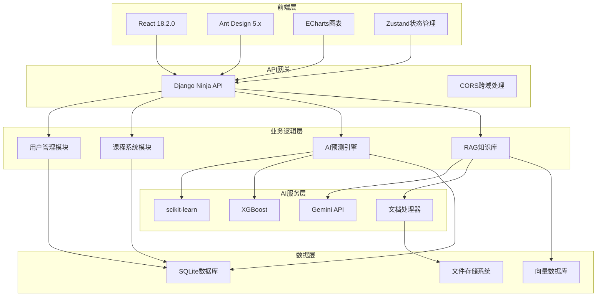

# 🔌 PowerEdu-AI 电力知识库与AI预测平台

<div align="center">


**集成电力知识库在线学习与AI负荷预测功能的企业级智能平台**

[](https://python.org)
[](https://djangoproject.com)
[](https://reactjs.org)
[](./LICENSE)
[](https://github.com/cfn0324/PowerEdu-AI/stargazers)
[](https://github.com/cfn0324/PowerEdu-AI)

</div>

## 📋 项目概述

PowerEdu-AI 是一个面向电力行业的**新一代智能教育平台**，采用现代化的前后端分离架构，融合了先进的人工智能技术与传统电力教育模式。平台通过RAG（检索增强生成）技术构建智能知识库，结合多种机器学习算法实现精准的电力负荷预测，为电力行业从业者提供全方位的学习与决策支持。

### 🌟 核心特色

<table>
<tr>
<td align="center" width="25%">

<br><br>
<b>🧠 RAG知识库</b>
<br>
基于大语言模型的智能问答系统，支持文档检索与知识推理
</td>
<td align="center" width="25%">

<br><br>
<b>🔮 AI负荷预测</b>
<br>
集成多种ML算法的电力负荷预测引擎，提供准确的负荷分析
</td>
<td align="center" width="25%">

<br><br>
<b>📚 在线教育</b>
<br>
完整的课程管理体系，配备成就系统激励学习进度
</td>
<td align="center" width="25%">

<br><br>
<b>📊 可视化分析</b>
<br>
交互式图表展示，直观呈现数据分析和预测结果
</td>
</tr>
</table>

### 🎯 核心功能

- **📚 智能教育模块**: 用户管理、课程体系、成就激励、学习追踪
- **🤖 AI预测引擎**: 多算法融合、负荷预测、趋势分析、性能评估  
- **📊 数据可视化**: 实时图表、交互分析、性能监控、报表生成
- **🧠 知识库系统**: RAG问答、文档管理、语义检索、智能推荐

## 🚀 快速启动

### 📋 系统要求

<table>
<tr>
<th>组件</th>
<th>最低版本</th>
<th>推荐版本</th>
<th>说明</th>
</tr>
<tr>
<td></td>
<td>3.8+</td>
<td>3.11+</td>
<td>后端运行环境</td>
</tr>
<tr>
<td></td>
<td>18.15+</td>
<td>20.0+</td>
<td>前端构建工具</td>
</tr>
<tr>
<td></td>
<td>4GB</td>
<td>8GB+</td>
<td>系统内存要求</td>
</tr>
<tr>
<td></td>
<td>2GB</td>
<td>5GB+</td>
<td>磁盘存储空间</td>
</tr>
</table>

### ⚡ 一键启动

<details>
<summary><b>🪟 Windows 环境</b></summary>

```powershell
# 克隆项目
git clone https://github.com/cfn0324/PowerEdu-AI.git
cd PowerEdu-AI

# 一键启动（自动安装依赖并启动服务）
.\start.ps1

# 或者手动修复依赖问题（如果遇到psycopg2-binary编译错误）
pip install -r requirements_windows.txt
```

> 💡 **Windows提示**: 如果遇到`psycopg2-binary`编译错误，请使用`requirements_windows.txt`替代`requirements.txt`

</details>

<details>
<summary><b>🐧 Linux/Mac 环境</b></summary>

```bash
# 克隆项目
git clone https://github.com/cfn0324/PowerEdu-AI.git
cd PowerEdu-AI

# 设置权限并启动
chmod +x start.sh && ./start.sh

# 或者手动修复前端依赖冲突（如果遇到ERESOLVE错误）
cd frontend
chmod +x fix-deps.sh && ./fix-deps.sh
```

> 💡 **Linux提示**: 如果遇到npm依赖冲突，请在`frontend`目录下运行`./fix-deps.sh`修复

</details>

> 💡 **提示**: 启动脚本会自动检测环境、安装依赖、初始化数据库并启动服务。首次启动需要网络连接下载依赖包。

## ⚙️ 高级配置

### 🔧 管理员账户设置

启动成功后，需要配置管理员账户以访问系统管理功能：

<details>
<summary><b>📝 管理员配置步骤</b></summary>

```bash
# 进入后端目录
cd backend

# 1. 创建前端业务管理员
python admin_manager.py create

# 2. 创建Django超级用户（系统管理）
python manage.py createsuperuser

# 3. 初始化成就系统
python manage.py init_achievements

# 4. 初始化知识库配置
python manage.py init_knowledge
```

</details>

### 🛠️ 手动启动模式

如需分步启动或开发调试，可使用手动启动模式：

<details>
<summary><b>🔧 后端服务启动</b></summary>

```bash
cd backend

# 安装Python依赖
pip install -r ../requirements.txt

# 数据库迁移
python manage.py migrate

# 初始化系统数据
python manage.py init_data          # 创建默认admin用户
python manage.py init_achievements  # 初始化成就系统
python manage.py init_knowledge     # 初始化知识库系统

# 启动Django服务
python manage.py runserver
```

</details>

<details>
<summary><b>🎨 前端服务启动</b></summary>

```bash
cd frontend

# 安装Node.js依赖
npm install

# 启动开发服务器
npm run dev
```

</details>

### 🤖 AI系统配置

<details>
<summary><b>🔑 API密钥配置</b></summary>

1. **复制环境配置文件**:
   ```bash
   cp .env.example .env
   ```

2. **配置AI模型API密钥** (选择其一):
   ```bash
   # Google Gemini (推荐)
   GEMINI_API_KEY=your-gemini-api-key-here
   GEMINI_MODEL=gemini-2.0-flash-exp
   
   # 或 OpenAI
   OPENAI_API_KEY=your-openai-api-key-here
   OPENAI_MODEL=gpt-3.5-turbo
   
   # 或 智谱AI
   ZHIPU_API_KEY=your-zhipu-api-key-here
   ZHIPU_MODEL=glm-4
   ```

3. **初始化AI预测模型**:
   访问 `http://localhost:5173/prediction` 并点击"初始化AI系统"

</details>

## 🌐 服务访问

### 📱 Web应用入口

<table>
<tr>
<th width="25%">服务模块</th>
<th width="35%">访问地址</th>
<th width="40%">功能描述</th>
</tr>
<tr>
<td></td>
<td><a href="http://localhost:5173">http://localhost:5173</a></td>
<td>平台主界面，用户登录及导航入口</td>
</tr>
<tr>
<td></td>
<td><a href="http://localhost:5173/knowledge">http://localhost:5173/knowledge</a></td>
<td>智能问答、文档管理、知识检索</td>
</tr>
<tr>
<td></td>
<td><a href="http://localhost:5173/prediction">http://localhost:5173/prediction</a></td>
<td>电力负荷预测、数据分析、模型管理</td>
</tr>
<tr>
<td></td>
<td><a href="http://localhost:5173/courses">http://localhost:5173/courses</a></td>
<td>在线课程、学习进度、成就系统</td>
</tr>
</table>

### 🛠️ 管理后台

<table>
<tr>
<th width="25%">管理系统</th>
<th width="35%">访问地址</th>
<th width="40%">管理功能</th>
</tr>
<tr>
<td></td>
<td><a href="http://localhost:8000/api">http://localhost:8000/api</a></td>
<td>RESTful API接口，支持第三方集成</td>
</tr>
<tr>
<td></td>
<td><a href="http://localhost:8000/admin">http://localhost:8000/admin</a></td>
<td>数据库管理、系统配置、模型管理</td>
</tr>
<tr>
<td></td>
<td><a href="http://localhost:8000/api/docs">http://localhost:8000/api/docs</a></td>
<td>交互式API文档，接口测试工具</td>
</tr>
</table>

### 🔑 默认账户信息

系统提供**双重管理体系**，满足不同层级的管理需求：

<div style="display: flex; gap: 20px;">

<details>
<summary><b>👨‍💼 业务管理系统</b></summary>

- **🌐 访问地址**: [http://localhost:5173](http://localhost:5173)
- **👤 用户名**: `admin`
- **🔐 密码**: `123456`
- **🔧 管理功能**: 
  - 课程内容管理
  - 用户学习数据
  - AI预测配置
  - 知识库内容
  - 成就系统设置

</details>

<details>
<summary><b>⚙️ 系统管理后台</b></summary>

- **🌐 访问地址**: [http://localhost:8000/admin](http://localhost:8000/admin)
- **👤 用户名**: `admin`
- **🔐 密码**: `admin123`
- **🔧 管理功能**:
  - 数据库直接操作
  - 用户权限管理
  - 系统配置修改
  - 模型参数调整
  - 日志监控分析

</details>

</div>

> ⚠️ **安全提醒**: 
> - 生产环境请务必修改默认密码
> - 建议启用两步验证增强安全性
> - 定期备份数据库和重要配置文件

> 💡 **自动初始化**: 首次启动时，系统会自动执行初始化脚本创建默认账户和基础数据。

## 🏗️ 技术架构

### 💻 核心技术栈

<table>
<tr>
<th colspan="2">后端技术</th>
<th colspan="2">前端技术</th>
</tr>
<tr>
<td></td>
<td>Web框架与API服务</td>
<td></td>
<td>用户界面框架</td>
</tr>
<tr>
<td></td>
<td>后端开发语言</td>
<td></td>
<td>UI组件库</td>
</tr>
<tr>
<td></td>
<td>轻量级数据库</td>
<td></td>
<td>前端构建工具</td>
</tr>
<tr>
<td></td>
<td>现代化API框架</td>
<td></td>
<td>状态管理</td>
</tr>
</table>

### 🤖 AI与数据科学

<table>
<tr>
<th>技术组件</th>
<th>版本</th>
<th>应用场景</th>
</tr>
<tr>
<td></td>
<td>1.3+</td>
<td>机器学习算法库，负荷预测模型</td>
</tr>
<tr>
<td></td>
<td>2.0+</td>
<td>梯度提升算法，高精度预测</td>
</tr>
<tr>
<td></td>
<td>2.0-flash-exp</td>
<td>大语言模型，RAG知识问答</td>
</tr>
<tr>
<td></td>
<td>0.1+</td>
<td>LLM应用框架，文档处理</td>
</tr>
<tr>
<td></td>
<td>5.4+</td>
<td>数据可视化，图表展示</td>
</tr>
</table>

### 🔧 系统架构图



### 🌟 核心功能模块

<details>
<summary><b>🎓 在线教育系统</b></summary>

- **用户认证与权限管理**: JWT令牌、角色分配、权限控制
- **课程内容管理**: 视频播放、文档阅读、进度追踪
- **成就激励系统**: 积分奖励、徽章解锁、排行榜
- **学习数据分析**: 学习时长、完成率、知识掌握度

</details>

<details>
<summary><b>🤖 AI预测引擎</b></summary>

- **多算法融合**: 支持线性回归、随机森林、XGBoost等
- **特征工程**: 时间序列分析、季节性调整、异常检测
- **模型评估**: RMSE、MAE、MAPE多维度性能指标
- **预测可视化**: 实时图表、趋势分析、置信区间

</details>

<details>
<summary><b>🧠 RAG知识库</b></summary>

- **文档处理**: 支持PDF、Word、Markdown等格式
- **向量检索**: 基于语义相似度的智能检索
- **知识问答**: 结合检索与生成的智能回答
- **多模型支持**: Gemini、GPT、智谱AI等大模型接入

</details>

<details>
<summary><b>📊 数据可视化</b></summary>

- **交互式图表**: 基于ECharts的动态数据展示
- **实时监控**: WebSocket实时数据更新
- **多维分析**: 时间序列、对比分析、分布统计
- **报表导出**: PDF、Excel、图片多格式导出

</details>

## 🤝 开发指南

### �️ 开发环境配置

<details>
<summary><b>🔧 本地开发设置</b></summary>

```bash
# 1. 克隆项目
git clone https://github.com/cfn0324/PowerEdu-AI.git
cd PowerEdu-AI

# 2. 创建Python虚拟环境（推荐）
python -m venv venv
source venv/bin/activate  # Linux/Mac
# 或
venv\Scripts\activate     # Windows

# 3. 安装后端依赖
pip install -r requirements.txt

# 4. 安装前端依赖
cd frontend
npm install

# 5. 配置环境变量
cp .env.example .env
# 编辑 .env 文件添加API密钥

# 6. 初始化数据库
cd ../backend
python manage.py migrate
python manage.py init_data
python manage.py init_achievements
python manage.py init_knowledge

# 7. 启动开发服务器
python manage.py runserver
```

</details>

### 📝 贡献指南

我们欢迎社区贡献！请遵循以下步骤：

1. **Fork 项目** 到您的GitHub账户
2. **创建特性分支**: `git checkout -b feature/AmazingFeature`
3. **提交更改**: `git commit -m 'Add some AmazingFeature'`
4. **推送到分支**: `git push origin feature/AmazingFeature`
5. **创建 Pull Request**

### 🐛 问题报告

如果您发现了bug或有功能建议，请：

- 查看 [Issues](https://github.com/cfn0324/PowerEdu-AI/issues) 确认问题未被报告
- 使用问题模板创建新的Issue
- 提供详细的重现步骤和环境信息

### 📚 开发文档

- **[API文档](http://localhost:8000/api/docs)**: 完整的后端API接口文档
- **[项目结构](./PROJECT_STRUCTURE.md)**: 详细的代码组织说明
- **[更新日志](./PROJECT_UPDATE_SUMMARY.md)**: 版本更新记录

## �📄 开源协议

本项目采用 [MIT License](./LICENSE) 开源协议。

```
MIT License

Copyright (c) 2025 PowerEdu-AI Team

Permission is hereby granted, free of charge, to any person obtaining a copy
of this software and associated documentation files (the "Software"), to deal
in the Software without restriction, including without limitation the rights
to use, copy, modify, merge, publish, distribute, sublicense, and/or sell
copies of the Software, and to permit persons to whom the Software is
furnished to do so, subject to the following conditions:

The above copyright notice and this permission notice shall be included in all
copies or substantial portions of the Software.
```

## 🙏 致谢

感谢以下开源项目和社区的支持：

- [Django](https://djangoproject.com/) - 强大的Python Web框架
- [React](https://reactjs.org/) - 现代化的前端UI框架  
- [Ant Design](https://ant.design/) - 优秀的React组件库
- [scikit-learn](https://scikit-learn.org/) - 机器学习算法库
- [Google Gemini](https://ai.google.dev/) - 先进的大语言模型

---

<div align="center">

**🚀 立即体验**: 执行 `.\start.ps1` (Windows) 或 `./start.sh` (Linux/Mac) 启动平台！

[](https://star-history.com/#cfn0324/PowerEdu-AI&Date)

**如果这个项目对您有帮助，请给我们一个 ⭐**

</div>
